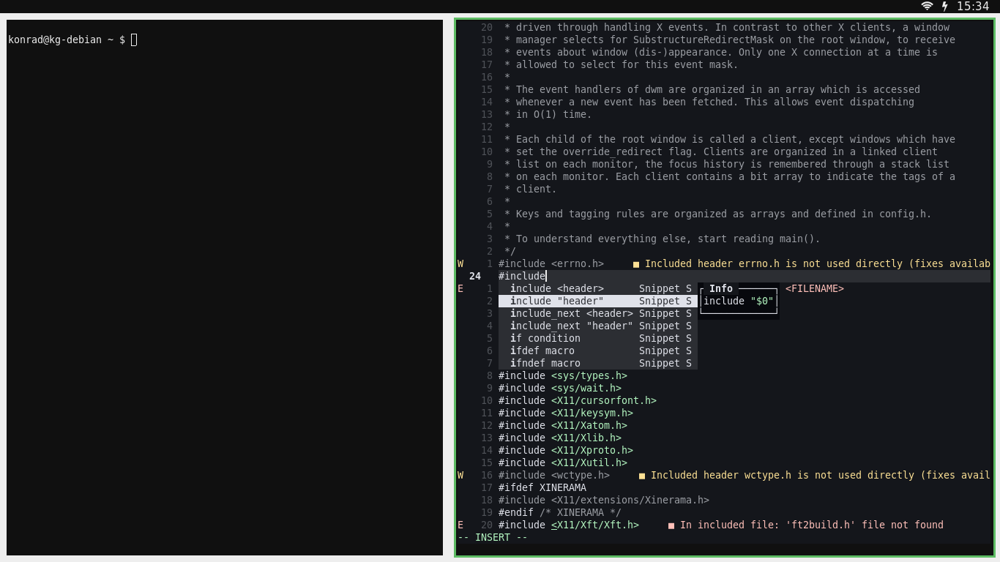

# Installation

> [!NOTE]
> Setup is running Debian minimal installattion with [Debian Netinstaller](https://www.debian.org/CD/netinst/)

 ## Sudo

> [!NOTE]
> Login as root

```
apt install sudo
```
```
usermod -aG sudo konrad
```
```
reboot
```

## Dotfiles

```
git clone https://github.com/gascko/Dotfiles.git ~/
```
```
cp ~/Dotfiles/.* ~/
```

## Packages

```
xargs sudo apt -y install < ~/Dotfiles/packages
```

 ## Network

```
managed=true
```

> /etc/NetworkManager/NetworkManager.conf

## Neovim

```
mkdir -p .config/nvim
```
```
git clone https://github.com/neovim/neovim ~/.config/nvim/
```
```
cd .config/nvim/neovim
```
```
make CMAKE_BUILD_TYPE=RelWithDebInfo
```
```
sudo make install
```
```
cp init.lua ~/.config/nvim/init.lua
```

## Suckless

```
mkdir .config/suckless
```
```
git clone https://git.suckless.org/dmenu ~/.config/suckless/dmenu
```
```
git clone https://git.suckless.org/dwm ~/.config/suckless/dwm
```
```
git clone https://git.suckless.org/slock ~/.config/suckless/slock
```
```
cp ~/Dotfiles/dwm.c ~/.config/suckless/dwm/
```
```
cp ~/Dotfiles/config_dwm.h ~/.config/suckless/dwm/config.h
```
```
cp -r ~/Dotfiles/scripts/ ~/.config/suckless/dwm/
```
```
cp ~/Dotfiles/config_dmenu.h ~/.config/suckless/dmenu/config.h
```

> [!NOTE]
> sudo make install for all

## Touchpad

```
sudo cp ~/Dotfiles/40-libinput.conf /etc/X11/xorg.conf.d/40-libinput.conf
```

## Firewall

```
sudo ufw enable
```
```
sudo ufw default deny incoming
```
```
sudo ufw default allow outgoing
```
```
sudo ufw allow DNS
```
```
sudo ufw allow CUPS
```

## GRUB

```
set GRUB_TIMEOUT=0
```

> /etc/default/grub

```
sudo update-grub2
```

## Tutanota

```
sudo wget https://app.tuta.com/desktop/tutanota-desktop-linux.AppImage -O /usr/bin/tutanota.AppImage
```
```
sudo chmod +x /usr/bin/tutanota.AppImage
```
